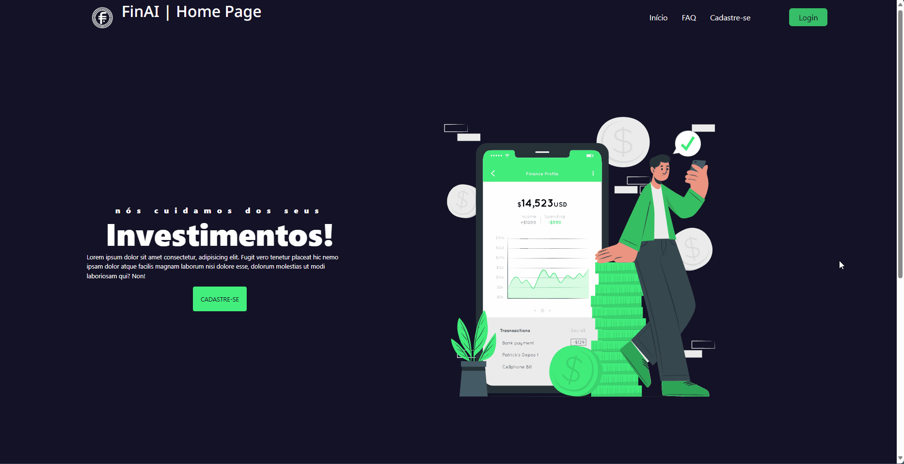
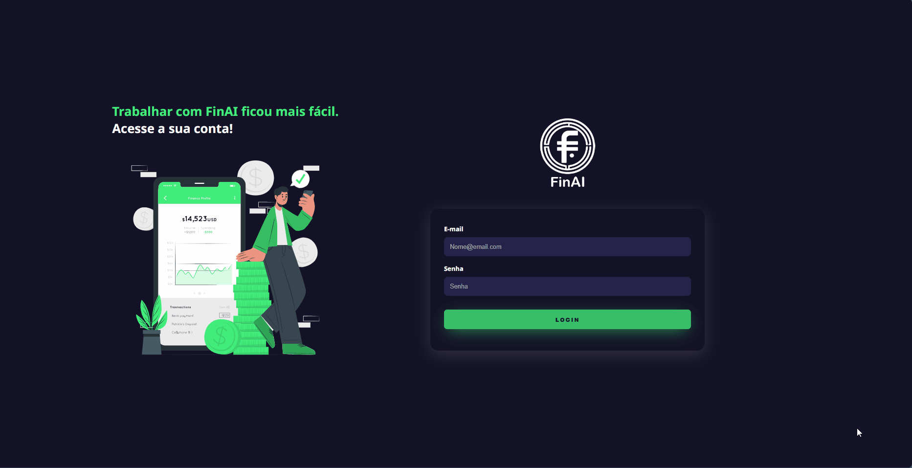
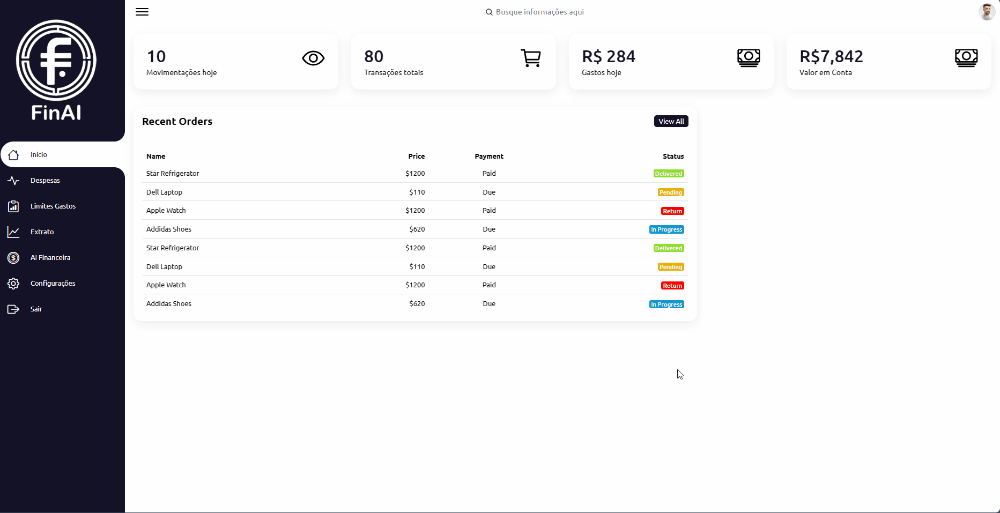

# Índice
* [Detalhes do Projeto](#detalhes-do-projeto)
* [Integrantes](#integrantes)
* [Prova de Conceito](#prova-de-conceito)
* [Ambiente de Desenvolvimento](#ambiente-de-desenvolvimento)
* [Execução do Projeto](#execução-do-projeto)
* [Exemplo de Uso e Funcionalidades](#exemplo-de-uso-e-funcionalidades)

# Detalhes do Projeto
 * Instituição:  Centro Universitrário SENAC – Santo Amaro.
 * Curso: Analise e Desenvolvimento de Sistemas
 * Ano: 2024
 * Disciplina: Projeto Integrador
 * Tema: Desenvolvimento de Sistemas Orientado a Dispositivos Móveis e Baseados na Web
 * Grupo: 10
   
# Integrantes
- Clei Lisboa Santos, [CleiL](https://github.com/CleiL)
- Daniel Siman Oliveira, [dsimanoliveira](https://github.com/dsimanoliveira)
- Guilherme Galarca da Costa, [guilhermemcr1](https://github.com/guilhermemcr1)
- Johnny Marques da Silva, [johnny-marques](https://github.com/johnny-marques)
- Olivia Villegas Garcia, [oliviavillegas](https://github.com/oliviavillegas)

  

<h1 align="center"> 
   Aplicativo Financeiro Web FinAI 
</h1>

# Prova de Conceito

 Relatório de gastos detalhado 

# Ambiente de Desenvolvimento
## Banco de Dados
Desenvolvido com MySQL Workbench.
## Backend
Desenvolvido com PHP.
## Frontend
Desenvolvido com HTML, CSS e JavaScript.

# Execução do Projeto
Projeto instalado em servidor de hospdagem da ValueHost.

 Acessivel em https://galarca.site/pi-senac/view/ 

# Exemplo de Uso e Funcionalidades
## Página principal do site (Home)

Home da aplicação, com opções de cadastro, login e FAQ.

## Cadastro de Usuário

Implementação de formulário para cadastro de novos usuários, com inserção dos novos usuários do banco de dados.

## Login
Para usuários já cadastrados, foi criado uma tela de login para entrar na aplicação.

## Tela do usuário
Após efetuado o login, o usuário é direcionado para a tela principal da aplicação.

Na tela principal da aplicação, há diversos menus com diferentes funcionalidades da aplicação.

* Início

No menu Início, é possível visualizar os lançamentos recentes, e também as principais métricas, como por exemplo: total de movimentações, transações totais, total gasto no dia atual e o valor em conta.

* Despesas

Na tela de despesas, são exibidas as principais despesas lançadas pelo usuário. É possível adicionar novas despesas e excluir despesas previamente lançadas.

* Limite de Gastos

Esta tela será implementada futuramente permitindo que o usuário defina limites de gastos para a categoria desejada, permitindo assim que o usuário tenha um melhor controle da sua vida financeira.

* Extrato

Esta tela será implementada futuramente, com o extrato total do usuário dos últimos dias.

* AI Financeira

Neste menu, será implementado uma inteligência artificial para ajudar os usuários com diversas dicas financeiras. O usuário poderá interagir com o bot por meio de perguntas, e receber diversas dicas que serão formuladas pela inteligência artificial.

* Configurações

Esta tela será implementada futuramente, permitindo que o usuário altere as configurações da plataforma de acordo com seu gosto pessoal.

* Sair

Usuário efetua o logout da plataforma.

